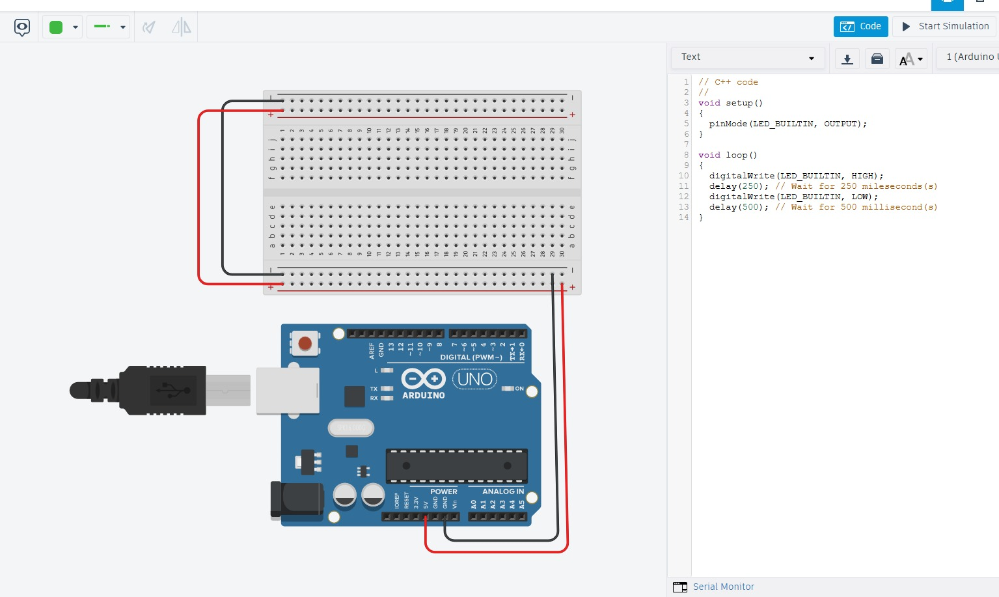
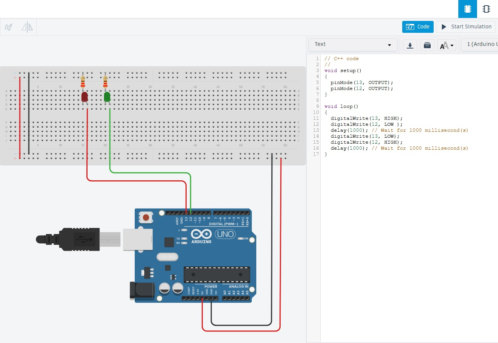
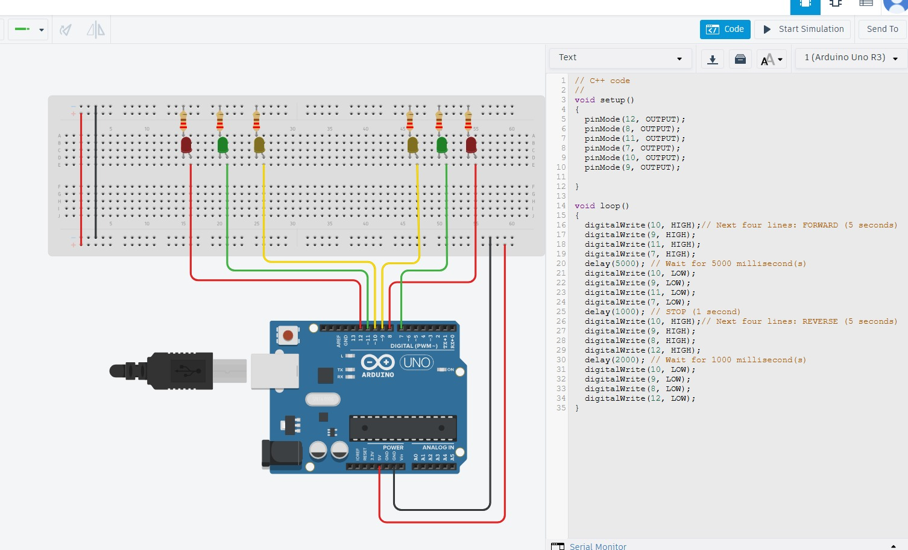
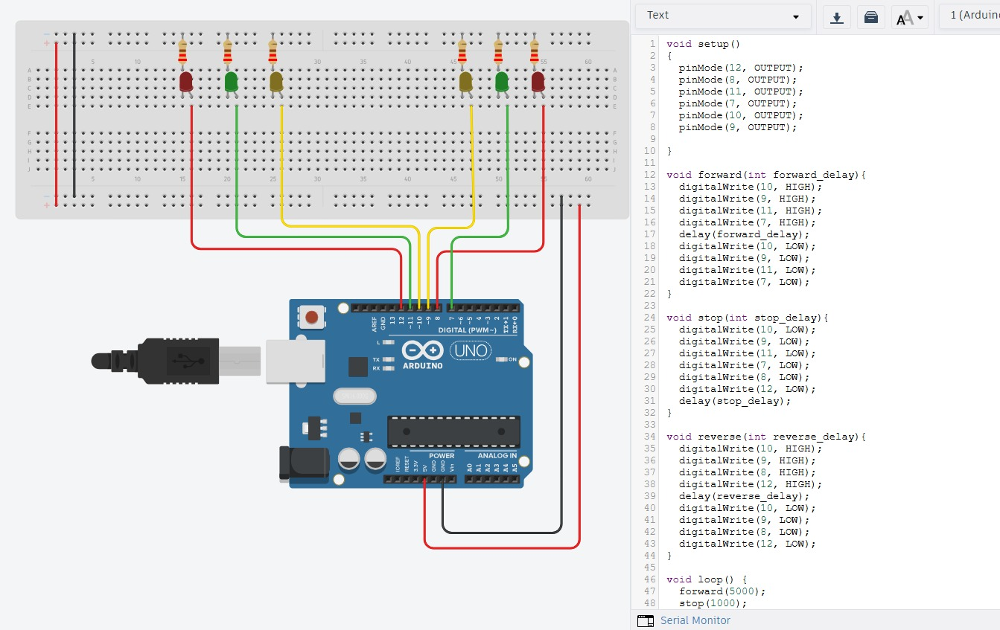
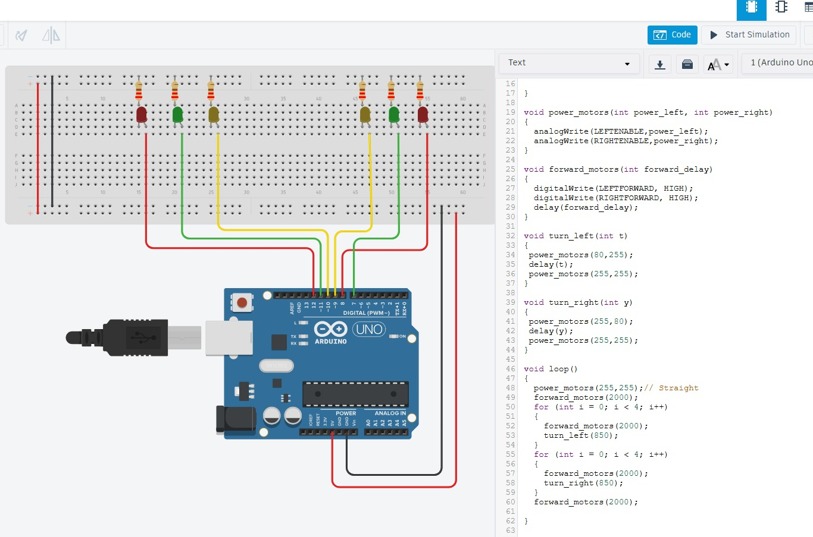
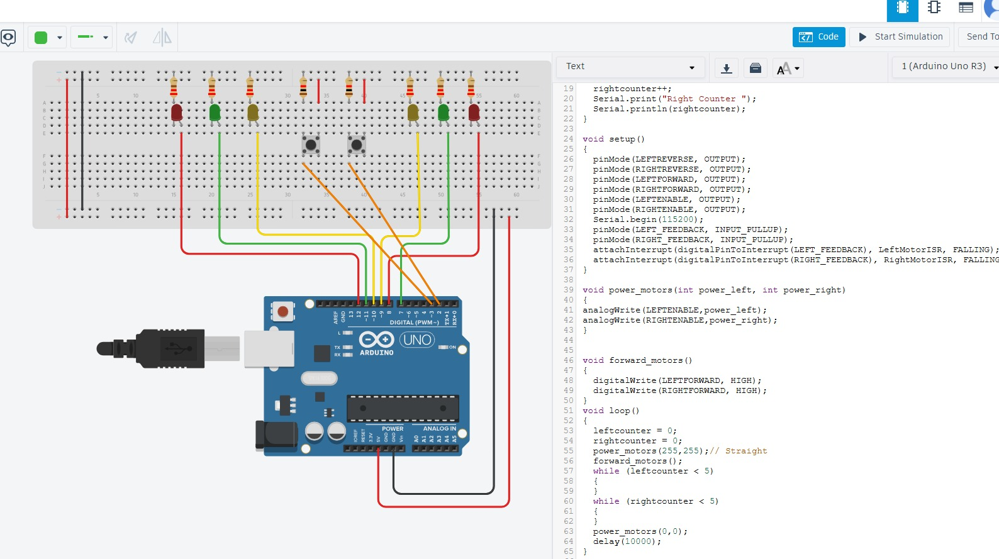
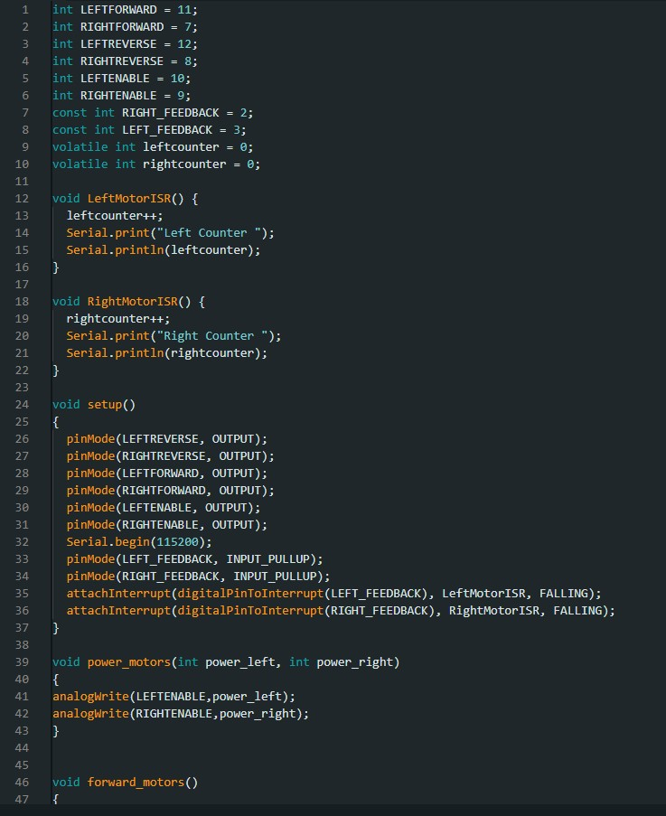
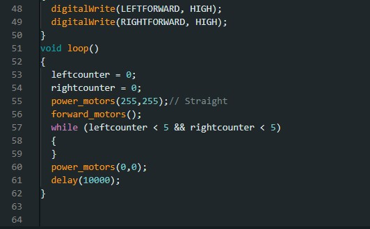
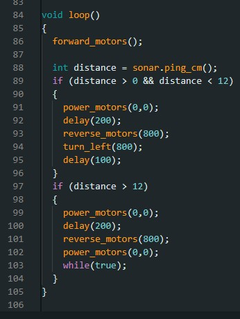
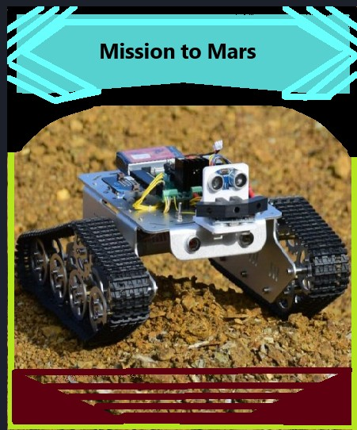

## Mission To Mars
## techcornwall
## 📘 Work Experience Stories

### ⚙️ Story 1 — Built in light function on Arduino Uno
 I learnt how to program the built in light on the Arduino Uno board. This helps show that the Arduino board is working properly

---

### ⚙️ Story 2 — Programming external LEDS on a breadboard
I learnt how to program external LEDS on a breadboard. This helped me get the hang of the Arduino code and gave me the pleasure to see my code work with the hardware.

---

### ⚙️ Story 3 — Simulating motors
Using LEDS to simulate power, forward motors, and reverse motors. This helped me learn how to use more complex code to make a pattern work.

---

### ⚙️ Story 4 — Using subroutines
I learnt how to use subroutines to make my code easier to read, debug, and understand.

---

### ⚙️ Story 5 — Functions
I learnt how to create specific patterns and functions and learnt how to use for loops

---

### ⚙️ Story 6 — Using distance over time
I used buttons to simulate rotations and distance to have more precise measurments rather than just fixed time intervals

---

### ⚙️ Story 7

---

### ⚙️ Story 8 — Avoiding obstacles
I learnt how to code a rover to avoid obstacles and follow a premade sequence when detecting objects near it

---

### ⚙️ Story 9 — Avoiding falls
Using a function, i made code that checks the surrounding elevation and if the drop in elevation is more than 12 cm the rover avoids it by following a premade sequence

---

### ⚙️ Story 10 — Poster

